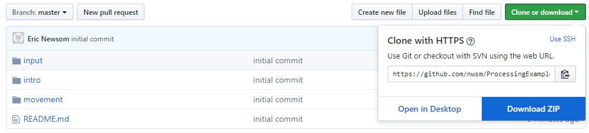

# Intro to Java / Object Oriented Programming with Processing

1. First download Processing: https://processing.org/download/

2. Next download this repository

3. Go into the examples to learn!

3a. Intro > Input > Movement > Classes

4. If you need a more in depth tutorial, this is tutorial series is good: http://hello.processing.org/editor/
